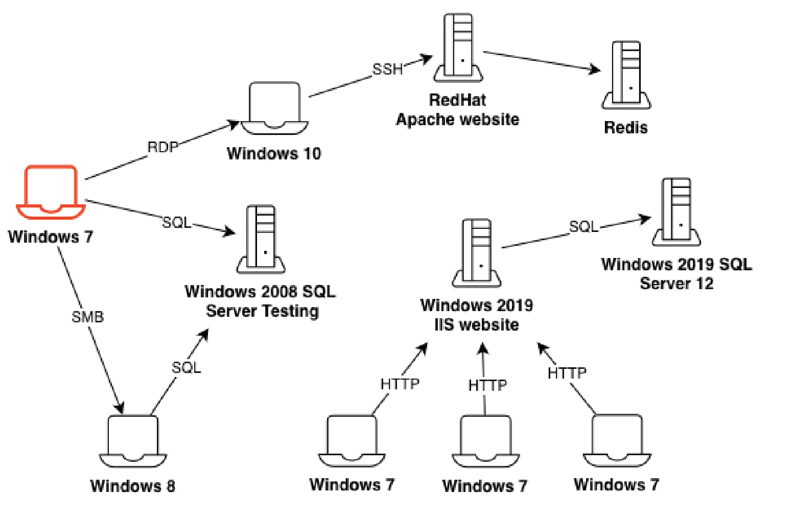

<div align="center">

# Autonomous Network Exploitation
### via Partially Observable Markov Decision Processes

*Training and evaluating a reinforcement learning agent for post-breach network exploitation*

[](https://python.org)
[](https://docker.com)
[](LICENSE)

</div>

---

## Overview

This project trains and evaluates a reinforcement learning agent capable of exploiting computer networks under a **post-breach assumption**, meaning the agent begins with an initial foothold inside the network and must autonomously expand its access.

<p align="center">
  
  <br>
  <em>Post-breach exploitation scenario</em>
</p>

A comparative study is conducted between a **novel Deep Recurrent Q-learning agent** and a **baseline Deep Q-learning agent**, both evaluated within Microsoft's [CyberBattleSim](https://github.com/microsoft/CyberBattleSim) Gym environment.

> **What is CyberBattleSim?**  
> An open-source RL environment by Microsoft that simulates a computer network where an agent exploits vulnerabilities using actions like password guessing and port probing to progressively move through the network.

---

## Results

Full experimental results, metrics, and analysis are available in the **[ report](docs/report.pdf)**.

---

## Setup

### Prerequisites
- [Docker](https://docs.docker.com/get-docker/) installed and running
- [VSCode](https://code.visualstudio.com/) with the [Dev Containers](https://marketplace.visualstudio.com/items?itemName=ms-vscode-remote.remote-containers) extension

### Steps

**1. Clone the repository**
```bash
git clone git@github.com:iv97n/cyber-agent.git
cd cyber-agent
```

**2. Pull the CyberBattleSim submodule**
```bash
git submodule init
git submodule update
```

**3. Build the Docker image**
```bash
docker build -t cyberbattle:1.1 ./cyberbattle
```

**4. Run the container**
```bash
docker run -it -v "$(pwd)":/source --rm --name cyberagent cyberbattle:1.1 /bin/bash
```

**5. Open in Dev Containers**  
Using the Dev Containers VSCode extension, attach to the running container and open the `/source` folder in a new window.

**6. Activate the environment**  
Inside the container, activate the conda environment:
```bash
conda activate cybersim
```

Now you're all set to open and run any notebook!


